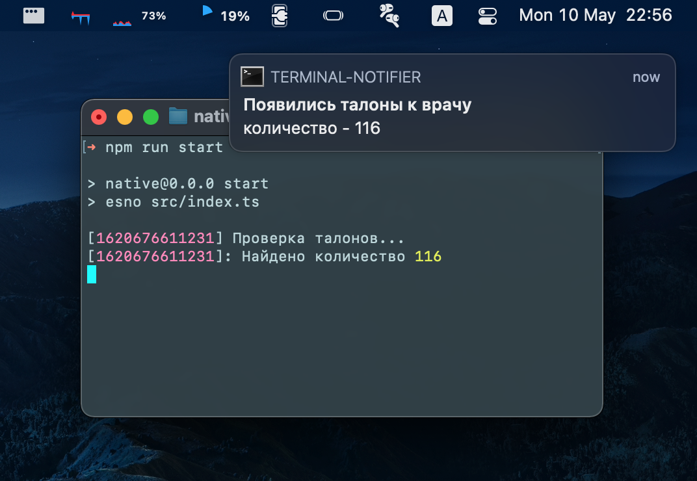
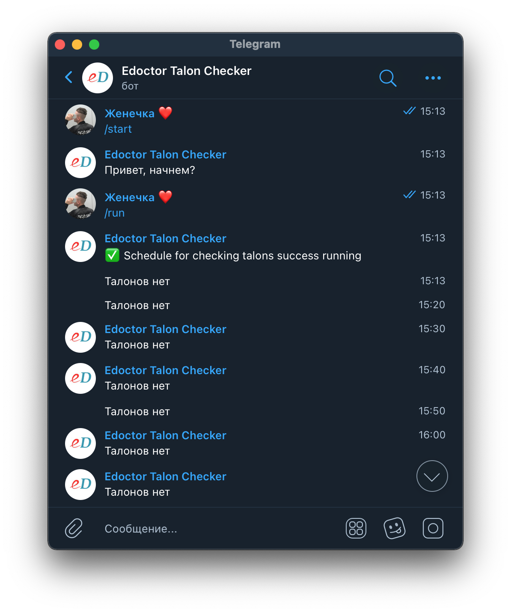

# eDoctor talon checker

Tool for check talon (a doctor's appointment card) availability,on Belarus online registry **eDoctor hospital info system**

## Packages

| Package                                                                                                            | Screenshots                                                        |
| ------------------------------------------------------------------------------------------------------------------ | ------------------------------------------------------------------ |
| [edoctor-talon-checker](https://github.com/reslear/edoctor-talon-checker/tree/main/packages/edoctor-talon-checker) |                                                                    |
| [not to click](https://www.youtube.com/watch?v=Kv-tbdVOuOA) |                                                                    |
| [native example](https://github.com/reslear/edoctor-talon-checker/tree/main/apps/native)                           |         |
| [telegram bot](https://github.com/reslear/edoctor-talon-checker/tree/main/apps/telegram-bot)                       |  |
| electron example                                                                                                   |
| fullstack app example                                                                                              |

## License

MIT &copy; [reslear](https://github.com/reslear)
