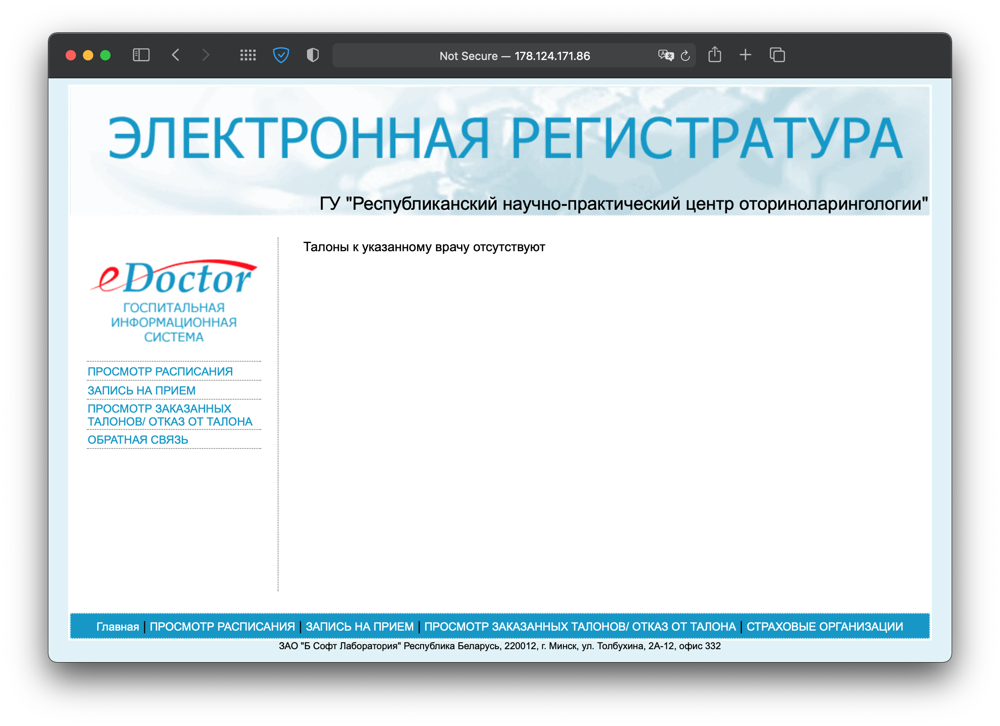
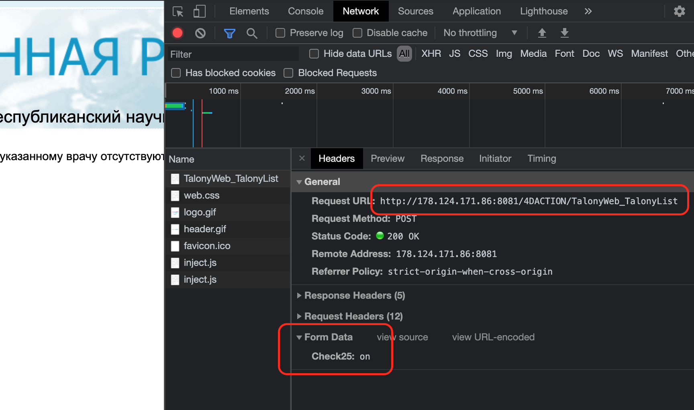

# Belarus talon checker



Tool for check talon (a doctor's appointment card) availability,on Belarus online registry **eDoctor hospital info system**

for example:

- [lor.by](https://lor.by)
  - original page with frame - http://lor.by/onlajn-zakaz-talona
  - frame - http://178.124.171.86:8081/4DACTION/TalonyWeb_TalonyList

## Using

1. clone this repo
2. change params
   - go to site and open `dev tools` in `Network` tab, select doctor on site and send data, see headers



```ts
init({
  // url
  url: 'http://178.124.171.86:8081/4DACTION/TalonyWeb_TalonyList',

  // form data
  form_data: { Check25: 'on' },
})
```

3. install deps `npm i`
4. start at `npm run start`
5. done :) wait available for order notification)

## License

MIT &copy; [reslear](https://github.com/reslear)
