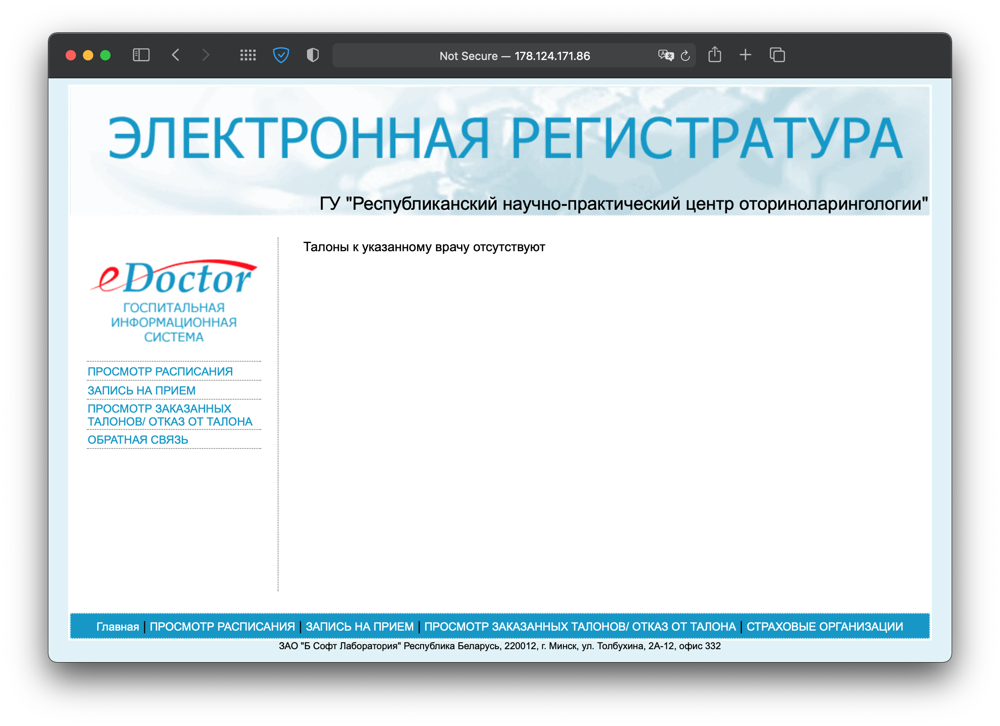
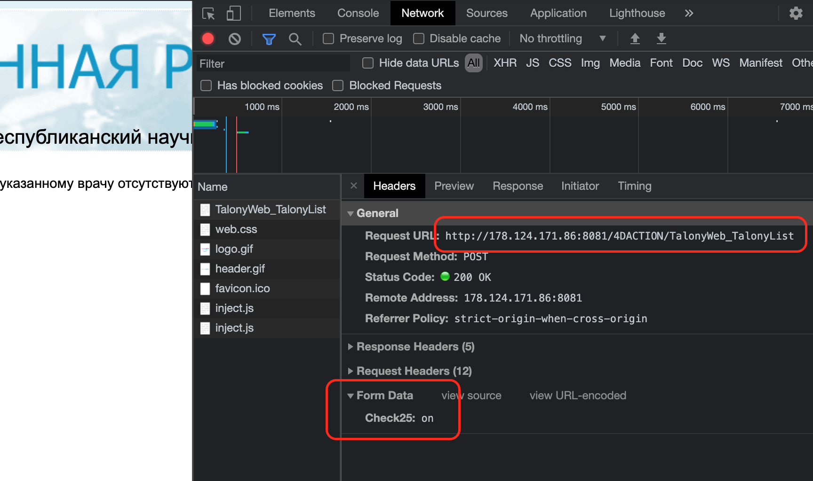

# eDoctor talon checker



Tool for check talon (a doctor's appointment card) availability,on Belarus online registry **eDoctor hospital info system**

## Install

```bash
npm i edoctor-talon-checker
```

## Usage

```ts
import { checkTalon } from 'edoctor-talon-checker'

setInterval(async () => {
  const { count } = await checkTalon({
    // url
    url: 'http://178.124.171.86:8081/4DACTION/TalonyWeb_TalonyList',

    // form data
    form_data: { Check25: 'on' },
  })

  console.log(`talons available: ${count}`)
}, 1000 * 5000)
```

## Example apps:

- [simple native server with notifications and cron](https://github.com/reslear/edoctor-talon-checker/tree/main/apps/native)
- electron (🏗 WIP)
- fullstack app (🏗 WIP)

## How to get url and FormData

for example:

- [lor.by](https://lor.by)
  - original page with frame - http://lor.by/onlajn-zakaz-talona
  - frame - http://178.124.171.86:8081/4DACTION/TalonyWeb_TalonyList

1. Go to site and open `dev tools` in `Network` tab, select doctor on site and send data, see headers



## TODO

- [ ] method to auto get and parse params

## License

MIT [reslear](https://github.com/reslear)
